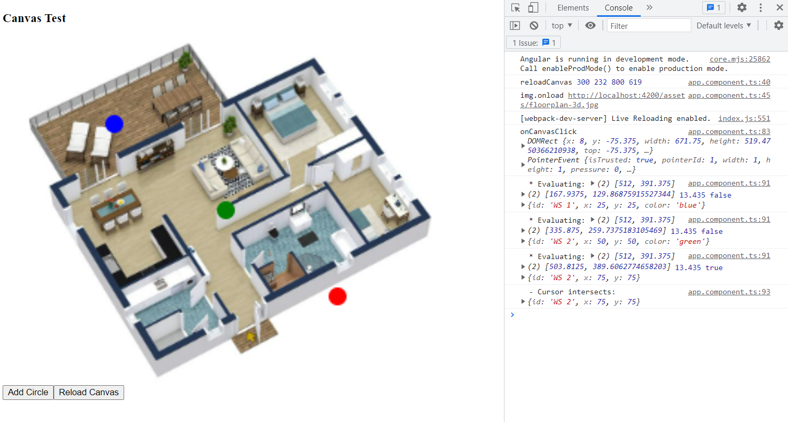

# HTML Canvas Test

Angular 14

## Installation

```
npm install
npm start
```

## Example

### v1


### v2


- Canvas resolution has been upscaled
- Profile icons (supporting 2 status modes) have been added

### v3
- Now works with "object-fit: contains"
- Image is auto-centered horizontally using flexbox
